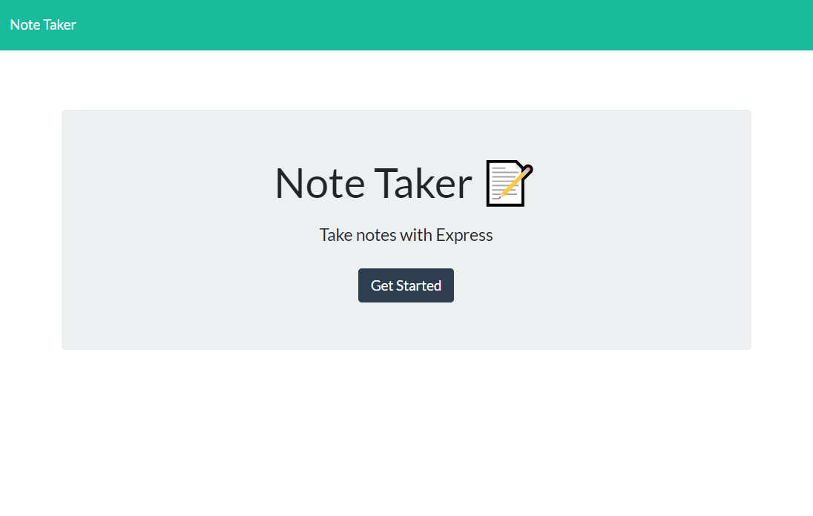
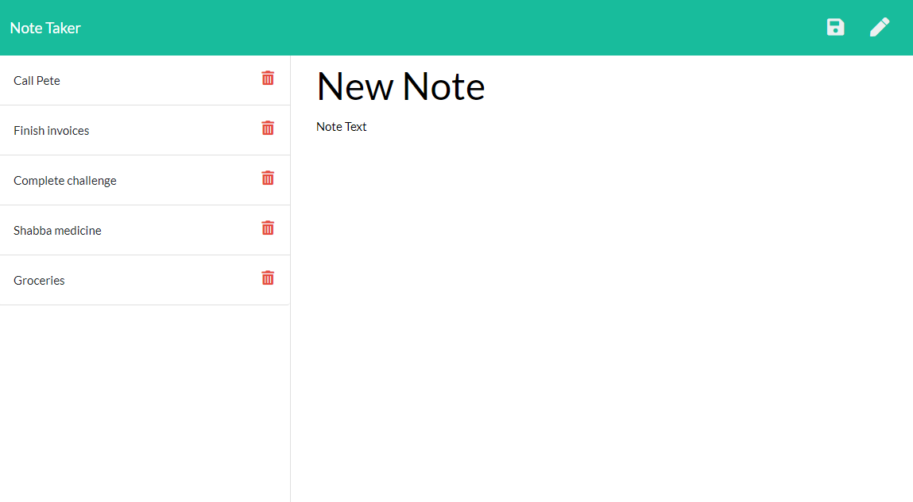

# Notable

## Description 
A note taking application that uses an Express.js-driven back end that captures user input to write, store, and delete notes.

## Deployed Application Link: https://goat-note.herokuapp.com/

## Table of Contents
* [Installation](#installation) 
* [Usage](#usage) 
* [License](#license) 
* [Contributing](#contributing)
* [Questions](#questions)

 
### Installation
  Clone or fork the code from the Notable repository on GitHub. Open the code in a standard code editing application, such as VS Code.
### Usage
 Open the deployed application via Heroku with the following link. On the landing page, click "Get Started" to open the "notes" page. Click on the empty title and note fields and write notes. Click the save button that appears in the upper-right corner to save your notes, as displayed in the left-hand column. Delete notes by clicking their corresponding trash can icons.

### Contributing
Notable is an open source project, and anyone is encourged to contribute by cloning or forking the code and working to improve its function and versatility.

### Questions
    
##### Interested in other projects from this developer? Visit the following GitHub profile:
https://github.com/mplumer
    
##### Send any questions to the following email address:
maxplumer12@gmail.com